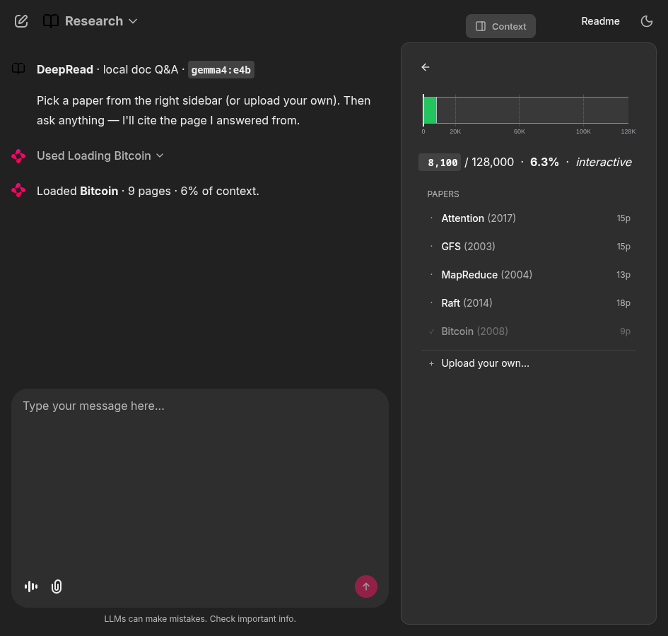

# DeepRead

> Local, long-context document Q&A with **Gemma 4 E4B** — load PDFs, ask anything, get page-cited answers. The model runs on your machine. Your documents never leave it.

[](LICENSE) [](pyproject.toml) [](https://chainlit.io) [](https://ollama.com/library/gemma4)

DeepRead is the build submission for the [dev.to Gemma 4 Challenge](https://dev.to/challenges/google-gemma-2026-05-06). It demonstrates that a high-quality document-intelligence experience can run **entirely on consumer hardware** — no cloud, no per-query cost, no telemetry — by leaning on Gemma 4 E4B's 128K context window instead of a RAG pipeline.



---

## Highlights

- **One chat, two modes.** Document Q&A is the default. Type `/bench show` or `/bench run --ctx 5000 20000 --needles 3` in the same chat to render the context-window stress-test charts inline — no profile switching, no history loss.
- **Native multimodality.** Pages go in as rendered images via Gemma 4's vision path — no OCR pipeline.
- **Live context budget.** A right-side sidebar shows the working set against the 128K ceiling, color-coded by latency tier (interactive / research / batch).
- **Page picker in the sidebar.** A custom React element renders the bundled classics directly in the right sidebar; clicking a row fires the same Python action callback that an in-chat button would.
- **Page-anchored citations.** The model is constrained to cite only the page ids it was given, so footnote references always resolve to real pages.
- **Five classic CS papers bundled.** Attention, GFS, MapReduce, Raft, Bitcoin — one click to load, zero network calls.

---

## Why Gemma 4 E4B

E4B is the only model in the Gemma 4 family — and arguably the only open model at this size today — that combines four properties at once:

1. **128K context window** wide enough to hold a complete research paper plus supplementary material in a single call.
2. **Native vision** that handles PDF pages rendered at 150 DPI without an OCR step.
3. **Native audio** input (kept reserved for future use; the current UI is text-first).
4. **~9.6 GB on-disk footprint** that runs comfortably on an 8 GB laptop GPU.

The 26B and 31B variants would push reasoning quality up, but they would kill the laptop story — and the whole point of DeepRead is that nothing leaves the machine. E2B was tempting for portability but loses fidelity on multi-step reasoning across long context. E4B is the precise sweet spot.

---

## Requirements

- **Python 3.11+** managed by [`uv`](https://github.com/astral-sh/uv)
- [**Ollama 0.24+**](https://ollama.com) with `gemma4:e4b` pulled (~9.6 GB)
- 8 GB GPU (RTX 4060/5050, Apple Silicon) or 16 GB+ system RAM for CPU mode
- Linux, macOS, or Windows + WSL2

---

## Quickstart

```bash
git clone https://github.com/yashksaini-coder/DeepRead.git
cd DeepRead
ollama pull gemma4:e4b           # one-time, ~9.6 GB
make install                     # uv sync
make run                         # launch on http://127.0.0.1:8000
```

Then open <http://127.0.0.1:8000>, pick **Bitcoin · 2008** for the fastest demo, and ask `What problem does proof-of-work solve in this paper?`. The answer streams back with `[^1]` footnote markers that resolve to specific pages.

---

## Makefile

```text
make install       Sync dependencies from pyproject.toml + uv.lock
make papers        (Re)fetch the bundled classic papers into papers_pdf_download/
make run           Launch Chainlit on $(PORT) (default 8000)
make dev           Launch Chainlit with hot-reload on file changes
make test          Run the full test suite
make smoke         Smoke-test text, vision, and PDF pipelines against the local Ollama
make smoketest     One-shot end-to-end pipeline check (ingest + budget + Ollama call)
make bench         Run the context-window sweep (writes benchmarks/results.json)
make bench-quick   Fast sweep — 2 zones, 3 needles (sanity check only)
make plot          Render benchmarks/plot.png from results.json
make clean         Remove pytest/python caches and Chainlit runtime artifacts
make help          Show this help
```

---

## Architecture

```
┌──────────────────────────────────────────────────────────────┐
│ Browser (Chainlit chat UI — one session, two modes)          │
│   • Default      — paper Q&A with citations + sidebar budget │
│   • /bench show  — render the latest sweep results           │
│   • /bench run … — kick off a fresh context-window sweep     │
└─────────────┬────────────────────────────────────────────────┘
              │ WebSocket (Chainlit transport)
              ▼
┌──────────────────────────────────────────────────────────────┐
│ app.py — Chainlit handlers                                    │
│   on_chat_start · on_message · action_callback · AskFileMsg   │
│   cl.user_session: shards + excluded set (per browser tab)    │
└─────────────┬────────────────────────────────────────────────┘
              │ pure-Python calls
              ▼
┌──────────────────────────────────────────────────────────────┐
│ deepread/  (UI-framework-independent)                          │
│  ingest.py     PDF → page-images via PyMuPDF (Shard objects)   │
│  budget.py     ~900 tok/page estimate · tier classification    │
│  citations.py  [[name#p3]] markers · known-id allow-list       │
│  papers.py     5 bundled PDFs in papers_pdf_download/          │
│  llm.py        stream_chat() — wraps Ollama with options       │
└─────────────┬────────────────────────────────────────────────┘
              │ HTTP /api/chat (streaming)
              ▼
┌──────────────────────────────────────────────────────────────┐
│ Ollama daemon → gemma4:e4b (Q4_K_M, 9.6 GB on disk)            │
└──────────────────────────────────────────────────────────────┘
```

The `deepread/` package is intentionally UI-agnostic — the Chainlit frontend is a thin layer over it, and could be swapped without touching the domain code.

---

## Repository layout

```
DeepRead/
├── app.py                     Chainlit entry point (ChatProfile, sidebar, actions)
├── Makefile                   make install / run / test / bench / clean
├── pyproject.toml             uv-managed deps (chainlit, plotly, pymupdf, ollama, ...)
├── chainlit.md                Chainlit welcome screen
├── public/
│   └── style.css              Indigo theme + sidebar typography + Plotly chrome hide
├── .chainlit/config.toml      Chainlit UI/audio settings
├── deepread/                  Domain package (UI-independent)
│   ├── ingest.py              PDF → Shards (PNG + extracted text + cite_id)
│   ├── budget.py              Token estimate + tier classification
│   ├── citations.py           [[cite_id]] grammar + allow-list parsing
│   ├── llm.py                 Ollama chat() wrapper (streaming)
│   ├── papers.py              5 bundled classics catalog
│   └── smoketest.py           End-to-end pipeline check (one Ollama call)
├── benchmarks/
│   ├── run_context_sweep.py   Needle-in-haystack sweep at 5K/20K/60K/100K
│   ├── plot.py                Matplotlib 3-panel render → plot.png
│   └── results.json           Append-only JSONL of sweep runs
├── scripts/
│   ├── refresh_papers.py      Download bundled classics
│   ├── smoke_pdf.py           PDF ingest smoke test
│   ├── smoke_text.py          Text-only Ollama call
│   └── smoke_vision.py        Single-image vision call
├── papers_pdf_download/       5 bundled classic CS papers (~3.3 MB total)
├── tests/                     48 pytest tests (deepread/* + app.py helpers)
└── .design/chainlit/          QA screenshots (latest = qa-v5-*)
```

---

## What 100K tokens actually costs (on an 8 GB laptop GPU)

A needle-in-a-haystack sweep at 5K / 20K / 60K / 100K tokens, with 5 unique 4-character codes seeded at fixed positions (5/25/50/75/95%) and asked back in isolation. Results from an RTX 5050 Laptop:

| Context | Pass rate | Tokens/sec | Time to first token |
|---:|:---:|---:|---:|
| 20K  | **5/5** | 8.6 | 15 s |
| 60K  | **5/5** | 7.6 | 38 s |
| 100K | **5/5** | 6.8 | **72 s** |

Recall held at 100% across the whole sweep. What broke was latency — **TTFT grew nearly linearly with context size**. Generation throughput stayed flat around 7–9 tok/s; the consumer-GPU tax shows up entirely in the prefill phase.

Reproduce:

```bash
make bench         # full sweep
make plot          # render benchmarks/plot.png
```

The Benchmark chat profile renders the same data interactively from `benchmarks/results.json`.

---

## Tests

```bash
make test                    # 48/48 pytest, ~4 s
make smoketest               # one-shot end-to-end check (requires Ollama running)
```

---

## License

MIT — see [`LICENSE`](LICENSE).
